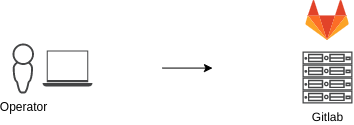

# DreamEnv

O proposito desse pequeno projeto e para estudos de um ambiente completo (na minha visão) de infraestrutura, cobrindo partes básicas e avançadas, funcionando de forma similar a um jogo (Lab gamificado?) e podendo ser implantado localmente (via VMs) ou cloud (via Terraform).

Esse projeto provavelmente vai ser lento e ira haver bastante experimentação ao longo do mesmo, portanto, estou aberto para críticas e sugestões.

Além do estudo do ambiente em si, e possível que saiam mini projetos de IAC ao longo do mesmo (leia roles, scripts e etc).

## Arquitetura

Abaixo esta a representação da arquitetura alvo do momento, a mesma vai ser atualizada continuamente para refletir os objetivos do projeto.

### Gitlab

O Gitlab vai ser a peca inicial do projeto, nele vamos armazenar o projeto em um repositorio, assim como o CI\CD dele.

## Requisitos

- VirtualBox
- Vagrant
- Terraform
- Ansible
- Shell

## TODO

- Debloat das imagens base das VMs
- Instalacao de pacotes basicos
- Vagrantfile dinamico